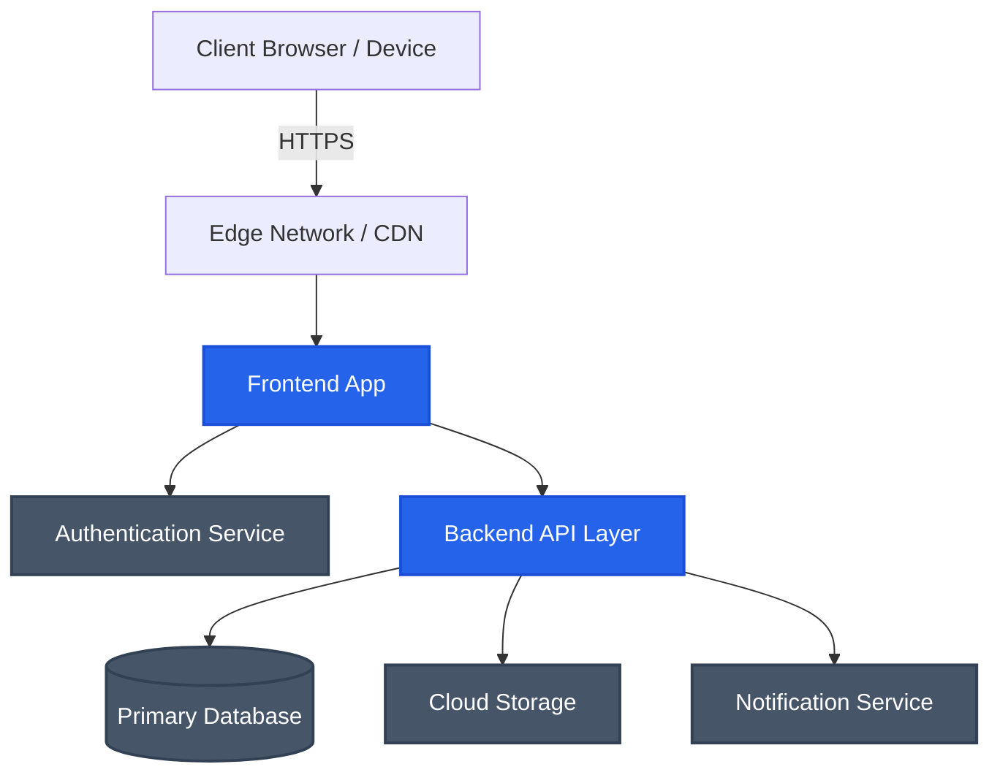

<div align="center">

# ConnectGaurav 🚀
**Official Communication Platform & Personal Developer Hub**

<p align="center">
  
  
  
  
</p>
<p align="center">
  
  
  
  
  
</p>

[**🌐 Visit connectwithgaurav.eu.cc**](https://connectwithgaurav.eu.cc)

</div>

---

## 📖 Project Vision

> **ConnectGaurav is not a traditional portfolio website.** It is a dedicated, enterprise-grade communication ecosystem.

### What is it?
ConnectGaurav is my official communication platform and personal developer hub. It is designed to facilitate seamless, structured, and professional interactions between me and the outside world.

### Why does it exist?
Traditional contact forms and email threads can be scattered and inefficient. This platform centralizes all professional communication, ensuring that every inquiry, proposal, and report is handled through a modern, unified interface powered by advanced engineering and proprietary implementations.

### Who is it built for?
- **Recruiters & Companies** looking to hire or collaborate.
- **Clients** seeking freelance or consulting services.
- **Collaborators & Developers** interested in discussing projects or sharing ideas.
- **Users** wanting to report bugs, request features, or submit feedback on my public projects.

---

## ✨ Features

The platform offers a comprehensive suite of tools tailored for professional engagement:

| Feature | Description |
| :--- | :--- |
| 💬 **Enterprise Messaging** | Secure and reliable direct communication channels. |
| 🐞 **Bug Reporting** | Structured workflows for submitting and tracking issues. |
| 💼 **Recruiter Portal** | Dedicated interfaces for hiring managers and talent acquisition. |
| 🤝 **Client Communication** | Streamlined channels for freelance and consulting inquiries. |
| 📂 **Project Discussions** | Focused spaces for collaborating on specific initiatives. |
| 🚀 **Feature Requests** | Organized submission forms for suggesting new ideas. |
| 📅 **Meeting Requests** | Integrated scheduling for professional discussions. |
| 🔒 **Secure Communication** | End-to-end focus on privacy and data integrity. |
| ⚡ **Modern UX** | Blazing fast, intuitive, and accessible user interfaces. |
| 📱 **Responsive Experience** | Flawless operation across desktop, tablet, and mobile devices. |

---

## 🛠️ Technology Stack

ConnectGaurav leverages modern, industry-standard technologies to ensure performance, scalability, and security.

| Category | Technology |
| :--- | :--- |
| **Frontend** | *[Placeholder: React / Next.js]* |
| **Backend** | *[Placeholder: Node.js / Serverless Functions]* |
| **Authentication** | *[Placeholder: Firebase Auth / NextAuth]* |
| **Database** | *[Placeholder: PostgreSQL / Firestore]* |
| **Hosting** | *[Placeholder: Vercel]* |
| **Storage** | *[Placeholder: AWS S3 / Cloud Storage]* |
| **Notifications** | *[Placeholder: SendGrid / Push]* |
| **AI Integration** | *[Placeholder: OpenAI API]* |
| **Analytics** | *[Placeholder: PostHog / Vercel Analytics]* |
| **Monitoring** | *[Placeholder: Sentry]* |
| **CI/CD** | *[Placeholder: GitHub Actions]* |

---

## 🏛️ Architecture

<details>
<summary><b>Click to expand Architecture Diagram</b></summary>



</details>

---

## 📁 Repository Structure

<details>
<summary><b>Click to expand Folder Tree</b></summary>

```text
ConnectGaurav/
├── .github/                  # GitHub Actions & Templates
├── public/                   # Static assets (images, fonts, etc.)
├── src/
│   ├── app/                  # Next.js App Router (Pages & Layouts)
│   ├── components/           # Reusable UI components
│   ├── lib/                  # Utility functions and shared logic
│   ├── services/             # API clients and external integrations
│   ├── styles/               # Global styles and Tailwind config
│   └── types/                # TypeScript type definitions
├── tests/                    # Unit and integration tests
├── .env.example              # Example environment variables
├── package.json              # Project dependencies and scripts
└── README.md                 # You are here!
```

</details>

---

## 🗺️ Roadmap

- [x] Initial project conceptualization and architecture design
- [ ] Core UI/UX design and prototyping
- [ ] Authentication and user management implementation
- [ ] Real-time messaging infrastructure
- [ ] Recruiter and Client portal development
- [ ] Bug reporting and feature request tracking systems
- [ ] Dashboard and analytics integration
- [ ] Production deployment and beta testing

---

## 📊 Development Status

> **Status:** Active Development 🚧

ConnectGaurav is currently in the active development phase. Features are being continuously implemented, tested, and refined. Core infrastructure is being laid out with a focus on scalability and security.

---

## 📚 Documentation

Detailed documentation for various aspects of the project can be found below:

- [API Reference](#) *(Placeholder)*
- [Component Storybook](#) *(Placeholder)*
- [Deployment Guide](#) *(Placeholder)*

*(Links will be updated as documentation becomes available)*

---

## 🤝 Contributing

**This repository is proprietary software and does not accept external contributions.**

While the repository is visible to the public to showcase the project and its development, we are not accepting pull requests, bug fixes, or feature additions from the community at this time. 

---

## 🔒 Security

Security is a top priority for ConnectGaurav. If you discover a vulnerability or security-related issue, please do not report it through public issues. 

Instead, please review our [SECURITY.md](SECURITY.md) *(Placeholder)* for instructions on how to responsibly disclose security vulnerabilities.

---

## ⚖️ License

> **PROPRIETARY SOFTWARE**

Copyright © 2026 Gaurav Patil.  
All Rights Reserved.

This repository and its contents are proprietary software. Public visibility on GitHub does not grant any express or implied permission or license to copy, modify, redistribute, use, or commercially exploit this software, in whole or in part.

Please refer to the [LICENSE](LICENSE) file for complete details.

---

## 📬 Connect

<div align="center">

| | |
| :--- | :--- |
| 🌐 **Website** | [connectwithgaurav.eu.cc](https://connectwithgaurav.eu.cc) |
| 🐙 **GitHub** | [@GauravPatil](#) *(Placeholder)* |
| 💼 **LinkedIn** | [in/gaurav-patil](#) *(Placeholder)* |
| 📧 **Email** | [Contact Me](#) *(Placeholder)* |

</div>

---

<div align="center">
  <br />
  <p>Built with passion by <b>Gaurav Patil</b>.</p>
  <p><b>ConnectGaurav</b> — Professional Communication Platform.</p>
  <br />
  <p><i>© 2026 Gaurav Patil. All Rights Reserved.</i></p>
</div>
